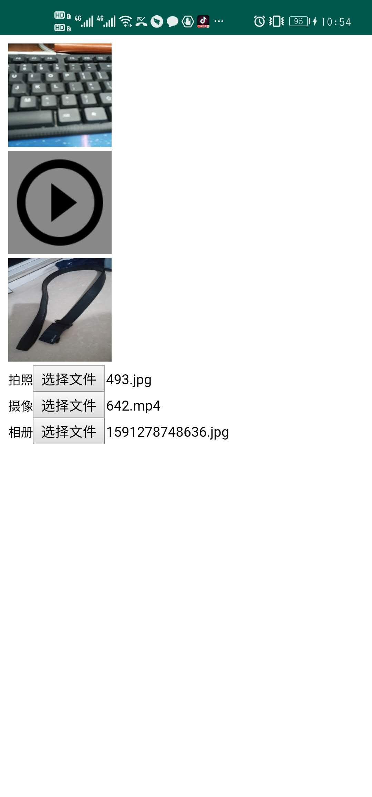

  之前一直认为H5调用Android，H5不需要Android配合能直接实现功能。前段时间，自己做这个功能，才发现不是这么回事。  
## H5编写  
  html文件里只需要<input>标签即可实现代码，代码如下所示：
```
<div>
    <span>拍照</span><input type="file" capture="camera" accept="image/*" id="photo" placeholder="拍照"
                          onchange="changePhoto()"/>
</div>
<div>
    <span>摄像</span><input type="file" capture="camcorder" accept="video/*" id="video"
                          placeholder="摄像" onchange="changeVideo()"/>
</div>
<div>
    <span>相册</span><input type="file" accept="image/*" id="picture" placeholder="相册"
                          onchange="changePicture()"/>
</div>
```
其中accept表示文件类型，capture表示将要进行的动作。  
## Android编写  
  Android需要监听webview，代码如下所示：
```
mWebView.setWebChromeClient(new WebChromeClient() {

            // For Android >= 5.0
            @RequiresApi(api = Build.VERSION_CODES.LOLLIPOP)
            @Override
            public boolean onShowFileChooser(WebView webView, ValueCallback<Uri[]> filePathCallback, FileChooserParams fileChooserParams) {
                LogUtil.d(TAG, "onShowFileChooser");
                mUploadCallbackAboveL = filePathCallback;
                if (fileChooserParams.isCaptureEnabled()) {
                    String[] acceptTypes = fileChooserParams.getAcceptTypes();
                    LogUtil.d(TAG, "acceptTypes=" + acceptTypes);
                    for (int i = 0; i < acceptTypes.length; i++) {
                        if (acceptTypes[i].contains("video")) {
                            mVideoFlag = true;
                            break;
                        }
                    }
                    if (mVideoFlag) {
                        recordVideo();
                        mVideoFlag = false;
                    } else {
                        takePhoto();
                    }
                } else {
                    pickPhoto();
                }
                return true;
            }

            // For Android < 3.0
            public void openFileChooser(ValueCallback<Uri> uploadMsg) {
                LogUtil.d(TAG, "openFileChooser1");
                mUploadMessage = uploadMsg;
                pickPhoto();
            }

            // For Android  >= 3.0
            public void openFileChooser(ValueCallback<Uri> uploadMsg, String acceptType) {
                LogUtil.d(TAG, "openFileChooser2");
                mUploadMessage = uploadMsg;
                mVideoFlag = acceptType.contains("video");
                if (mVideoFlag) {
                    recordVideo();
                    mVideoFlag = false;
                } else {
                    pickPhoto();
                }
            }

            //For Android  >= 4.1
            public void openFileChooser(ValueCallback<Uri> uploadMsg, String acceptType, String capture) {
                LogUtil.d(TAG, "openFileChooser3");
                mUploadMessage = uploadMsg;
                if (!TextUtils.isEmpty(capture)) {
                    mVideoFlag = acceptType.contains("video");
                    if (mVideoFlag) {
                        recordVideo();
                        mVideoFlag = false;
                    } else {
                        takePhoto();
                    }
                } else {
                    pickPhoto();
                }
            }
        });
```
 需要监听以上方法，兼容多版本Android。       
## 总结  
  H5调用Android拍照和摄像以及选取相册，需要html文件里使用input标签，Android原生监听webview回调，做出相应处理。效果如下所示：
  


